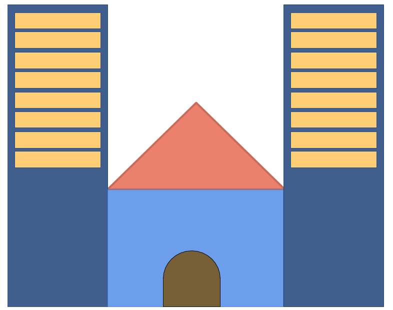

# Nececity

Nececity is a city emulator software written in Rust.

In it, you can create modern cities with your friends and family, and
over the internet. 

You will be able to build a city and focus it in a specific area:
being a massive energy producer, a technology point, a gambling
paradise or a summer dreamland!

The game will be also playable in servers within the Internet.

## Gameplay

The primary difference is that, unlike other genres, you don't need to
have *everything* in your city, because, in real cities, you don't.

> Like: you don't have a power plant, subway, an university etc., in
> one single city, why would you have in a virtual city?

So, instead of finding everything in a city, the citizens will search
in the entire "state".  
The citizen will have a job directly connected within a building
type. If this building is found within a certain distance, he'll not
move from your city. Otherwise, it will.

Also, you will be able to rent certain services from other cities,
like water treatment, energy and the like. As a consequence, those
services will be proportionally more expensive than other games of
same genre 

## Engine details

### Individual

It all starts with the individual

The individual will have a profession, that is linked with a building
type. The said profession has a field and a instruction level. 

The individual will also have a sex and an age.

It also will have an intelligence level (affects how fast it
learns, and how much), a beauty level (affects how faster it
can find a partner), a speak level (affects how famous it can
be). Those parameters will be created randomically on the first
generation, but will depend on the parents and grandparents for the
next ones.

It has, also, satisfaction levels for knowledge, health, neighborhood,
safety, air quality and entertainment.

### Family

Then, we have a family. A family, in the game, has a man, a woman and
zero or more kids, of random genders.

> In the game, mostly low-instruction people, with some exceptions,
> will migrate to your city at first.

> I might include gay couples in the game, because we're all for
> diversity today :wink: 

Each kid will have a predisposition to a profession, that will last
until it completes 18, the time where it becomes the kid -- now, a
teen -- profession.

This predisposed profession will depend on the family wealth. If the
family is wealthy, the kid will mostly choose the profession of one of
its parents

> The wealth is proportional: it will depend on the average of the
> kid's school colleagues: if its family wealth is bigger than a
> certain percentage above the average, his family is wealthy, if is
> below than a certain percentage, his family is poor, and if is in
> the middle, his family is on the average.

If the family is poor, the kid will choose other alternative
profession.

The family will also have an instruction level. The family instruction
level is the weightened average of it's members. Both parents have a
bigger weight than the children.

The kid increase of instruction level depends on how good the
school is, and how much smart the kid is (see "Individual")

The smart children will also need more specialized schools, like
technical ones, to improve their knowledge. If the city and the
neighbor cities lack this type of city, the kid knowledge satisfaction
will decrease.

The satisfaction levels that can affect something are the levels of
each family: the average value of satisfaction of each member

### Places

The places are, well, places where individuals meet. The standards
(like wealth, safety, intelligence) of every people will update when
they go to the main places (the workplace, for adults, or the school,
for not adults). 

The people will usually be friends of other people with the same
wealth. 

> For parents, it is *their* wealth that counts, not the family
> ones. For children, otherwise, is the *family* wealth.

If the wealth distribution is too uneven, even their friends will be
significantly richer than them. The individual will become sad, and
unproductive, and will eventually be fired.

It will need to find other places, Every place that fits it is OK,
but the last two it worked. If it can't find a fitting place, the
individual will be unemployed.

To overcome the sadness for being too poor -- or too rich! It *can*
happen on the other side too --, build more houses and appropriate
jobs.

> Yes, even in the real world there are jobs that people see as
> "poor people jobs", and ones that people see as "rich people jobs".

Usually, workplaces and schools are places where individuals meet,
but, in entertainment places, families meet, and the family attributes
are compared.

### Dating and marriage

When someone is more than 16 years old, is time to start
dating. In the game, people usually date with school colleagues,
neighborhood colleagues or job colleagues. 

A person will choose other person that has the same job interest,
intelligence, appearance, speak ability, wealth or lives in the same
region as him.  
For now, one person will choose other person of the opposite sex (like I
said before, I might introduce gay couples, for realism), give a weight
for each attribute, and choose the one that has the highest
score. If the other person holds the pretendent as one of the 3
highest scored persons, they start dating.

When finding pretendents, people who are dating have a score
reduction, that increases on engagement, and on marriage.

The relationship finishes when the score reduces too much, or when a
better person appears in the same school, neighborhood or job.

If the relationship lasts more than 5 years, it's time to
engage. Here, both scores double.  
If the relationship lasts more 1-2 years, depending on wealth (we have
to prepare the marriage), it's time to marry. The scores double again
here.

If a couple break, they resume finding a partner after 1 month ~~of sorrow~~.

People usually have children within 1-5 year of marriage, depending on
wealth. The number of children depends on the intelligence and beauty
level of the couple: intelligence decrease the quantity, beauty
increase.

### City

Here is where the player works: at city level.

The city is where the individuals live, families live and places are
located. The player is the mayor of the city. 

It can build constructions, control taxes, commercialize with other
cities (e.g, by buying/selling energy, water etc.)

If you increase taxes too much, families will not like: people usually
complain when the government raises taxes too much. 

Also, it can decrease the family own wealth. Families like to preserve
the wealth if they can't increase it, so, if the family can't preserve
its wealth too long, they will move to a neighbor city.

Construction building is good, but take care! Some industries can
increase pollution, thus decreasing the air quality and making
citizens complain. Also, an individual doesn't like much when you
destroy its house, or make a construction site near his house to build
something.

> Building of commerce, industry and residence is done like most of
> simulation games do: with zones.

You can buy energy, water or trash treatment from other cities,
because, e.g individuals won't like a powerful power plant too near
their houses (maybe less powerful ones, like the wind ones, but they
aren't too strong) because of the sound or pollution, and they are
expensive.

However, the other city that will make the price. The minimal price is
the cost price, and the maximum depends on your neighbor. (The game
will have a chat, *soooo* both can negotiate this)

## Network

The game will be playable locally, within a LAN or with the Internet.

You of your friends will be able to focus in an area, as long as
the basic needs (sufficient education, sufficient entertainment etc.)
are being fullfilled.

The only difference between LAN and Internet is that, when playing
with a LAN, the game server will generate "virtual cities", so that
you can focus in your area without needing to fullfill every need of
your citizens (they can go elsewhere, as long as they live in *your* city)

## Technologies

 - The graphic API will be Vulkan

## License

This game is licensed under the MIT license.

(C) 2018 Arthur Mendes
